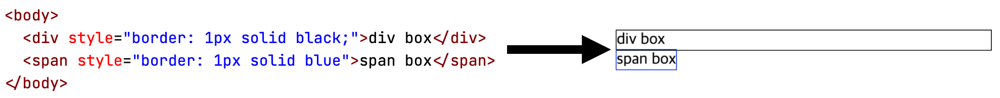
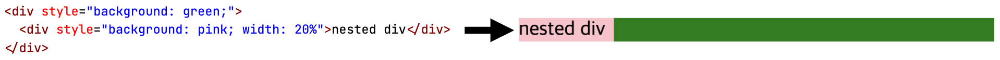
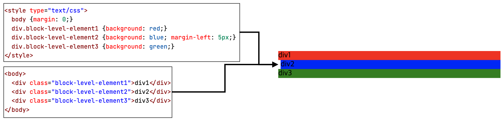
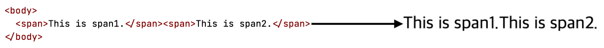

# Element vs. Box

엘리먼트(element)는 페이지에 렌더링되고 나면 각각 대응하는 박스(box)로 변환된다. 렌더링 후에는 엘리먼트라는 개념이 사라지고 전부 박스의 형태로만 존재하는 것이다:

> In the visual formatting model, each element in the document tree generates zero or more boxes according to the box model.

## Containing block

엘리먼트에 일부 CSS 프로퍼티를 적용하면 엘리먼트에 대응하는 박스의 위치나 크기가 특정 기준에 대해 상대적으로 변경되게 할 수 있는데, 그러한 조작의 기준 역할이 되는 사각 영역을 containing block이라고 한다. 일반적으로 containing block은 부모/조상 박스에 대응하지만, 항상 그런 것은 아니기 때문에 단순히 부모/조상 박스라고 말하지 않고 추상화하여 containing block이라고 부른다:

> In CSS 2.1, many box positions and sizes are calculated with respect to the edges of a rectangular box called a containing block. In general, generated boxes act as containing blocks for descendant boxes; we say that a box "establishes" the containing block for its descendants. The phrase "a box's containing block" means "the containing block in which the box lives," not the one it generates.

# Box's type

프로그래밍 언어에서 포맷, 크기, 쓰임새 등을 기준으로 데이터의 타입을 구분하는 것처럼, 박스도 자신이 페이지 상에 놓이는 방법에 따라 타입별로 분류될 수 있다. 프로그래밍 언어에서 데이터 타입은 타입 지정자로 명시하지만, CSS에서는 `display` 프로퍼티가 박스의 타입을 결정한다.

> A box's type affects, in part, its behavior in the visual formatting model. The 'display' property [...] specifies a box's type.

## Block-level box

블록-레벨 엘리먼트(block-level element)는 `display` 프로퍼티의 값으로 `block`, `list-item`, `table` 중의 하나가 지정된 엘리먼트이다.

> Block-level elements are those elements of the source document that are formatted visually as blocks (e.g., paragraphs). The following values of the 'display' property make an element block-level: 'block', 'list-item', and 'table'.

이러한 블록-레벨 엘리먼트가 페이지 상에 렌더링되고 난 후에 만들어지는 박스의 타입이 블록-레벨 박스(block-level box)이다. 블록-레벨 박스의 특징은 자신의 containing block의 상단에서부터 시작해서 차곡차곡 아래로 수직으로 배치되며, 왼쪽 마진 모서리(margin/outer edge)가 containing block의 왼쪽 모서리에 닿는다는 점이다:

위 그림에서 `div.block-level-element*`들의 containing block은 `body`이다. 이 `div`들 중에서 `div.block-level-element2`에는 왼쪽 마진을 `5px`만큼 주었는데, 왼쪽 "마진 모서리"가 `body`의 왼쪽 모서리에 닿는다는 의미를 분명히 하기 위함이다.

> [block-level] boxes are laid out one after the other, vertically, beginning at the top of a containing block. [...] each [block-level] box's left outer edge touches the left edge of the containing block (for right-to-left formatting, right edges touch).

## Inline-level box

인라인-레벨 엘리먼트(inline-level element)는 `display` 프로퍼티의 값으로 `inline`, `inline-table`, `inline-block` 중의 하나가 지정된 엘리먼트로서, 컨텐츠를 표현하기 위해서 별도의 블록을 따로 만들지 않고 그냥 컨텐츠가 라인 상에 놓여지게 만들기 위해서 사용한다.

> Inline-level elements are those elements of the source document that do not form new blocks of content; the content is distributed in lines (e.g., emphasized pieces of text within a paragraph, inline images, etc.). The following values of the 'display' property make an element inline-level: 'inline', 'inline-table', and 'inline-block'. 

이러한 인라인-레벨 엘리먼트가 페이지 상에 렌더링되고 난 후에 만들어지는 박스의 타입이 인라인-레벨 박스(inline-level box)이다. 인라인-레벨 박스의 특징은 containing block의 상단에서부터 시작해서 차례대로 하나씩 수평으로 배치된다는 점이다:

> [inline-level] boxes are laid out horizontally, one after the other, beginning at the top of a containing block.

# Formatting context

TODO

# Reference

- [Cascading Style Sheets Level 2 Revision 1 (CSS 2.1) Specification, 9. Visual formatting model](https://www.w3.org/TR/2011/REC-CSS2-20110607/visuren.html)